# Sales Intelligence Platform

B2B news-to-lead pipeline: fetches region-curated RSS sources → NLI filter → entity clustering → LLM synthesis → multi-agent enrichment → personalized outreach. Self-learning through 6 feedback loops.

## Quick Start

**Prerequisites:** Python 3.11+, Node 20+

```bash
# Clone and install
git clone <repo> && cd sales_agent
python -m venv venv && venv/Scripts/activate
pip install -r requirements.txt
python -m spacy download en_core_web_sm

cd frontend && npm install && cd ..

# Configure (set at minimum OPENAI_API_KEY)
cp .env.example .env

# Run (two terminals)
uvicorn app.main:app --reload --port 8000    # terminal 1: API
cd frontend && npm run dev                   # terminal 2: frontend (port 3000)
```

## CLI Usage

```bash
# Default: India industry-first, 120h window
python main.py

# US fintech, last 48 hours
python main.py --region US --industry "Fintech" --hours 48

# Track specific companies (company-first mode)
python main.py --mode company --companies "Zepto,Blinkit,Swiggy" --region IN

# Score clusters against your products
python main.py --region IN --products "cold-chain SaaS,inventory platform"

# See exactly which sources will be fetched for a region
python main.py --list-sources --region IN

# Add/remove individual sources for one run
python main.py --region IN --remove-sources sebi_v2,rbi_v2
python main.py --region GLOBAL --add-sources techcrunch_main,forbes

# Start FastAPI server (port 8000)
python main.py --server

# Run all validation tests
python main.py --test

# Verbose mode (shows INFO logs including provider chain)
python main.py --verbose
```

**Region codes:** `IN` (India, 49 sources), `US` (35 sources), `EU` (14 sources), `SEA` (9 sources), `GLOBAL` (all 107 active sources).

Each region uses a curated source list — India runs fetch only Indian business publications, US runs fetch only US publications + global B2B press. No cross-region noise flooding the NLI filter.

## Required Environment Variables

Minimum working configuration (set in `.env`):

```bash
# At least one LLM provider (OpenAI recommended — first in chain, 500+ RPM)
OPENAI_API_KEY=sk-...

# Optional but improves quality
GEMINI_API_KEY=...           # GCP Vertex fallback
GROQ_API_KEY=...             # Free fallback (100K tokens/day)
NVIDIA_API_KEY=...           # Best embeddings (nv-embedqa-e5-v5)
HUNTER_API_KEY=...           # Email finding for contacts
TAVILY_API_KEYS=key1,key2    # Better article search (up to 7 keys)
```

See `.env.example` for all 50+ tunable parameters (clustering thresholds, similarity weights, concurrency limits, etc.).

## System Architecture Overview

```mermaid
flowchart TD
    CLI["CLI / FastAPI<br/>main.py --mode industry/company/report"] --> scope
    scope["DiscoveryScope<br/>{mode, region, hours, companies, industry, products}"]
    scope --> N1

    subgraph LangGraph["agents/orchestrator.py — LangGraph StateGraph (8 nodes)"]
        N1["Node 1: source_intel_node<br/>source_intel.py<br/>RSS fetch · Tavily web search<br/>scrape + embed · classify events<br/>→ articles[] in deps"]

        N1 -->|"0 articles → skip"| N8
        N1 -->|"articles found"| N2

        N2["Node 2: analysis_node<br/>analysis.py<br/>calls intelligence/pipeline.execute()<br/>bridges clusters → TrendData[]<br/>retries up to 2× with adaptive params"]

        subgraph intel["intelligence/pipeline.py — 10 math-first stages (called by Node 2)"]
            f1["1. FETCH<br/>region-filtered RSS + Tavily<br/>→ 100-500 articles"]
            --> f2["2. DEDUP<br/>URL + TF-IDF cosine<br/>title (0.85) · body (0.70)"]
            --> f3["3. NLI FILTER<br/>nli-deberta-v3-small<br/>accept ≥ 0.88 · reject ≤ 0.10<br/>→ 10-20% pass rate"]
            --> f4["4. ENTITY NER<br/>GLiNER B2B labels<br/>+ spaCy en_core_web_sm<br/>+ entity quality cache"]
            --> f5["5. SIMILARITY MATRIX<br/>6-signal N×N<br/>semantic(0.35)+entity(0.25)+source(0.15)<br/>+event(0.10)+temporal(0.10)+lexical(0.05)"]
            --> f6["6. CLUSTERING<br/>entity groups: HAC(n≤50) / HDBSCAN(n&gt;50)<br/>ungrouped: Leiden community detection<br/>Optuna-tuned k + resolution"]
            --> f7["7. VALIDATION<br/>7-check gate per cluster<br/>size · coherence · entity density<br/>source diversity · temporal span"]
            --> f8["8. SYNTHESIS ← FIRST LLM CALL<br/>GPT-4.1-mini structured output<br/>+ Reflexion retry (max 2)"]
            --> f9["9. PRODUCT MATCH<br/>cluster embedding ↔ product embedding<br/>+ keyword overlap scoring"]
            --> f10["10. LEARNING UPDATE<br/>Signal Bus → 6 loops in parallel"]
        end

        N2 -->|"calls"| f1
        f10 -->|"IntelligenceResult"| N3

        N3["Node 3: impact_node<br/>market_impact.py<br/>ImpactAnalyzer: 4 perspectives<br/>Tavily precedent search<br/>cross-trend compound analysis<br/>→ ImpactAnalysis[]"]
        --> N4

        N4["Node 4: quality_validation_node<br/>quality.py<br/>validate coherence + impact confidence<br/>fail-open: keep top 3 if all fail<br/>→ PASS · RETRY(→N2, max 2×) · SKIP(→N8)"]

        N4 -->|"retry"| N2
        N4 -->|"no viable trends"| N8
        N4 -->|"viable"| N5

        N5["Node 5: causal_council_node<br/>causal_council.py<br/>hop1: companies NAMED in article<br/>hop2: buyers / suppliers<br/>hop3: downstream chain<br/>BM25 KB → real company names<br/>→ CausalChainResult[]"]
        --> N6

        N6["Node 6: lead_crystallize_node<br/>orchestrator.py<br/>hops → concrete LeadSheets<br/>KB company name resolution<br/>company-specific news fetch<br/>→ LeadSheet[]"]
        --> N7

        N7["Node 7: lead_gen_node<br/>leads.py<br/>company enrichment (DB cache + enricher)<br/>contacts: Apollo(3) + Hunter(2)<br/>emails: GPT-4.1-mini structured<br/>→ PersonProfile[]"]
        --> N8

        N8["Node 8: learning_update_node<br/>orchestrator.py<br/>SourceBandit · EntityQualityCache<br/>ThresholdAdapter · HypothesisLearner<br/>→ data/*.json (persisted)"]
    end

    N7 --> DB["SQLite leads.db<br/>+ ChromaDB article vectors"]
    f10 --> learningfiles["data/<br/>source_bandit.json · filter_hypothesis.json<br/>adaptive_thresholds.json · entity_quality.json<br/>weight_learner.json · signal_bus.json · experiments.jsonl"]
```



## Pipeline Architecture (Stage Detail)

10 deterministic stages — LLM only enters at stage 8 (synthesis), not before:

```
Stage 1: FETCH
  Region-filtered RSS (IN=49 sources / US=35 / GLOBAL=107)
  + Google News RSS per target company
  + Tavily news search per company/industry
  → 100-500 raw articles per run

Stage 2: DEDUP
  Pass 0: URL normalization (strip query params + trailing slash) → exact match
  Pass 1: TF-IDF cosine on title (threshold=0.85) → catches syndicated copies
  Pass 2: TF-IDF cosine on body/summary (threshold=0.70) → catches rewrites
  → removes ~10% of articles per run

Stage 3: NLI FILTER  ← first quality gate
  Model: cross-encoder/nli-deberta-v3-small (Yin et al. 2019, arXiv:1909.00161)
  auto_accept >= 0.88 → keep (no LLM call)
  auto_reject <= 0.10 → drop (no LLM call)
  0.10-0.88 → LLM batch classify (B2B vs B2C distinction)
  → keeps ~10-20% of articles (B2B business events only)
  Real precision: 90.9% on 48h live data (10/11 B2B correct)

Stage 4: ENTITY NER
  GLiNER with B2B labels: startup, enterprise, VC firm, exec, financial_institution
  SpaCy en_core_web_sm supplementary on article titles
  Entity quality cache: pseudo-label propagation (NAACL 2024 naacl-short.49)
  → company mentions + entity quality scores

Stage 5: SIMILARITY MATRIX
  6-signal hybrid: semantic (0.35) + entity (0.25) + source (0.15)
                   + event_type (0.10) + temporal (0.10) + lexical (0.05)
  Temporal: dual-sigma Gaussian (σ=8h for breaking, σ=72h for ongoing)
  Same-source penalty: 0.3× (forces cross-source clustering)
  Weights adapt via EWC weight learner (Kirkpatrick et al. 2017)

Stage 6: CLUSTERING
  Entity groups (articles about same named entity):
    n < 5         → single cluster (no algorithm)
    5 ≤ n ≤ 50   → HAC, average linkage, silhouette sweep (threshold 0.30-0.65)
    n > 50        → HDBSCAN, min_cluster_size=5, soft membership
  Discovery mode (ungrouped articles):
    Any n         → Leiden community detection, Optuna k+resolution tuning

Stage 7: VALIDATION  ← second quality gate
  Per-cluster checks:
    - min 2 articles, min 2 distinct sources
    - coherence >= 0.40 (mean pairwise cosine)
    - entity consistency >= 0.60
    - temporal window <= 720h
    - composite score >= 0.50 (weighted: entity 0.35 + keyword 0.30 + embedding 0.35)
  Entity-seeded clusters bypass coherence hard-veto (entity overlap IS the signal)

Stage 8: SYNTHESIS  ← LLM enters here
  GPT-4o-mini (or provider chain fallback) generates trend label + summary
  Reflexion retry: up to 3 attempts if output fails schema validation
  CRITIC validation: checks logical consistency of synthesized claims
  Input: top-5 representative articles per cluster

Stage 9: MATCHING
  Keyword overlap (0.50) + semantic similarity (0.30) + industry tag (0.20)
  Scores clusters against user product catalog
  Urgency detection from temporal recency + event type

Stage 10: LEARNING  ← async, after pipeline
  Source bandit: update Beta posteriors (Thompson Sampling)
  NLI hypothesis: SetFit retraining if 16+ labeled examples available
  Entity quality: update cumulative coherence cache
  Weight learner: EWC gradient step on signal weights
  Threshold adapter: EMA update (α=0.1) on validation thresholds
  Experiment tracker: log run metrics to data/experiments.jsonl
```

**Real run results (from actual recordings and live runs):**

| Run | Fetched | After NLI | Clusters | Coherence | Time |
|-----|---------|-----------|----------|-----------|------|
| India 48h (March 9, 2026) | 550 | 88 (16%) | 6 | 0.199 | ~14 min |
| India 48h (March 9, 2026) | 433 | 53 (13.7%) | 5 | 0.788 NLI avg | ~12 min |
| India 120h (Feb 27, best) | ~1200 | ~200 (18%) | 14 | — | ~29 min |
| India 120h (Feb 27) | 371 | — | 14 | — | ~29 min; 32 leads, 25 emails |

Sample clusters from March 9 run (120h India):
- `[0.414] n=7` — Indian Startup Funding and Gender Gap
- `[0.360] n=12` — Samsung Galaxy M17e 5G India Launch ⚠️ (B2C false positive)
- `[0.113] n=23` — Mastercard Launches Agentic Commerce Trust Layer
- `[0.109] n=17` — Flipkart Completes Reverse Flip to India
- `[0.093] n=5` — Huawei Smart Retail Solutions at EuroShop 2026

## Multi-Agent System (LangGraph)

An 8-node LangGraph `StateGraph` orchestrates the full pipeline. Node 2 (analysis) calls `intelligence/pipeline.execute()` internally — the intelligence pipeline runs *inside* LangGraph, not before it.

```
┌─────────────────────────────────────────────────────────────────────────────────┐
│  StateGraph  (stream_mode="updates", pydantic-ai FallbackModel)                 │
│                                                                                  │
│  ┌──────────────────┐                                                            │
│  │  source_intel    │  RSS feeds (bandit-weighted) + Tavily web search           │
│  │  source_intel.py │  scrape full content + generate embeddings                 │
│  │  Node 1          │  classify event types (funding/regulation/tech/...)        │
│  └────────┬─────────┘  → articles[] stored in deps                              │
│           │ conditional: 0 articles → skip to learning_update (Node 8)          │
│           ▼                                                                      │
│  ┌──────────────────┐                                                            │
│  │  analysis        │  calls: intelligence/pipeline.execute() [10 stages]        │
│  │  analysis.py     │  bridges IntelligenceResult.clusters → TrendData[]         │
│  │  Node 2          │  retries up to 2× with adjusted adaptive params            │
│  └────────┬─────────┘  state writes: trends[]                                   │
│           ▼                                                                      │
│  ┌──────────────────┐                                                            │
│  │  impact           │  calls: workers/impact_agent.py → ImpactAnalyzer          │
│  │  market_impact.py │  4 perspectives: direct · indirect · vendors · confidence │
│  │  Node 3           │  Tavily precedent search for high-impact trends           │
│  └────────┬──────────┘  state writes: impacts[]                                 │
│           ▼                                                                      │
│  ┌──────────────────┐                                                            │
│  │  quality_valid.  │  validate cluster coherence + noise ratio                  │
│  │  quality.py      │  filter impacts below confidence threshold                 │
│  │  Node 4          │  fail-open: keep top 3 if ALL below threshold              │
│  └────────┬─────────┘  → PASS · RETRY(→Node2, max 2×) · SKIP(→Node8)           │
│           ▼                                                                      │
│  ┌──────────────────┐                                                            │
│  │  causal_council  │  multi-hop impact tracing (pydantic-ai tool calling)       │
│  │  causal_council  │  hop1: companies NAMED in article (citation required)      │
│  │  .py · Node 5    │  hop2: buyers / suppliers of hop1 companies                │
│  └────────┬─────────┘  hop3: downstream chain · BM25 KB → real company names    │
│           ▼            state writes: _causal_results[]                           │
│  ┌──────────────────┐                                                            │
│  │  lead_crystallize│  causal hops → concrete LeadSheets                         │
│  │  orchestrator.py │  KB company name resolution (replaces segment placeholders)│
│  │  Node 6          │  fetch company-specific news from ChromaDB                 │
│  └────────┬─────────┘  generate opening_line + service_pitch per hop            │
│           ▼            state writes: _lead_sheets[]                              │
│  ┌──────────────────────────────────────────────────────────────────────────┐   │
│  │  lead_gen_node (leads.py) — 4 enrichment phases, concurrent internally  │   │
│  │  Node 7                                                                  │   │
│  │  Phase 1: company enrichment                                             │   │
│  │    DB cache (7d TTL) → domain resolution → company_enricher.enrich()    │   │
│  │    Semaphore(5) · 8s timeout per company                                 │   │
│  │    → CompanyData {name, domain, industry, description, hq, ceo}         │   │
│  │                                                                          │   │
│  │  Phase 2: contact finding (contact_agent.py)                             │   │
│  │    TREND_ROLE_MAP → target roles (AI→CTO, funding→CFO, cyber→CISO)      │   │
│  │    Apollo: search_people_at_company() — Semaphore(3)                     │   │
│  │    Hunter: find_email(domain, full_name) — Semaphore(2)                  │   │
│  │    → ContactResult[] filtered by EMAIL_CONFIDENCE_THRESHOLD=70           │   │
│  │                                                                          │   │
│  │  Phase 3: email generation (email_agent.py)                              │   │
│  │    GPT-4.1-mini structured output with company.news_snippets[0]          │   │
│  │    → OutreachEmail {subject, opening, value_prop, cta, ps_line}          │   │
│  │                                                                          │   │
│  │  Phase 4: person profiles                                                │   │
│  │    seniority_tier: decision_maker · influencer · gatekeeper              │   │
│  │    reach_score: email confidence + verified + linkedin + tier            │   │
│  │    → PersonProfile[] sorted by tier then reach_score DESC                │   │
│  └────────┬─────────────────────────────────────────────────────────────────┘   │
│           ▼                                                                      │
│  ┌──────────────────┐                                                            │
│  │  learning_update │  publishes to signal_bus (3-phase no-circular protocol):  │
│  │  orchestrator.py │    Phase 1: each loop updates from THIS run's raw data     │
│  │  Node 8          │    Phase 2: bus computes cross-loop derived signals        │
│  └──────────────────┘    Phase 3: loops apply cross-loop adjustments            │
│                          SourceBandit · EntityQualityCache · ThresholdAdapter    │
│                          HypothesisLearner → data/*.json (persisted)            │
└─────────────────────────────────────────────────────────────────────────────────┘
```

### State Flow (AgentState TypedDict)

```python
class AgentState(TypedDict):
    # Source intel output
    scope: DiscoveryScope
    run_id: str
    articles: Annotated[List[Article], operator.add]       # append-only

    # analysis_node adds (from intelligence/pipeline.execute())
    trends: List[TrendData]

    # impact_node adds
    impacts: List[ImpactAnalysis]

    # quality_validation_node writes
    viable_trends: List[TrendData]
    quality_scores: Dict[str, float]                       # trend_id → score

    # lead_gen_node adds
    companies: Annotated[List[CompanyData], operator.add]
    contacts: Annotated[List[ContactResult], operator.add]
    outreach_emails: Annotated[List[OutreachEmail], operator.add]
    hop_signals: Annotated[List[HopSignal], operator.add]  # for learning
    learning_signals: Annotated[List[LearningSignal], operator.add]
```

### Worker Sub-Agent Communication Protocol

Workers in `lead_gen_node` are NOT LangGraph nodes — they are regular async functions
called via `asyncio.gather()`. They communicate through:

1. **Input**: receive `AgentDeps` (lazy-init shared state container) + trend-specific data
2. **Output**: return typed Pydantic models (`workers/schemas.py`)
3. **Side effects**: write to ChromaDB article cache, SQLite leads table
4. **Error handling**: each worker has its own try/except; failure of one does not block others

```
AgentDeps (shared, lazy-initialized, never serialized)
├── deps.llm         → LLMService (initialized on first access)
├── deps.chromadb    → ChromaDB client
├── deps.embeddings  → EmbeddingTool
├── deps.apollo      → ApolloTool (Semaphore(3))
├── deps.hunter      → HunterTool (Semaphore(2))
└── deps.brevo       → BrevoTool (email sending)
```

**Why AgentDeps is never serialized:** LangGraph `"values"` mode tries to msgpack-serialize
the entire state, including `AgentDeps` which contains asyncio locks, ChromaDB client handles,
and open HTTP sessions. `"updates"` mode only sends the TypedDict diff per node. This is why
`stream_mode="updates"` is a hard invariant.

### TREND_ROLE_MAP (contact_agent.py)

Contact role selection is deterministic by trend event type — no LLM needed for this:

| Event type | Primary contact role | Rationale |
|-----------|---------------------|-----------|
| `ai_adoption` / `tech_launch` | CTO, VP Engineering | Technology buyer |
| `funding` / `ipo` | CFO, VP Finance | Financial decision maker |
| `expansion` / `acquisition` | COO, CEO | Strategic decision maker |
| `cybersecurity` | CISO, VP Security | Domain buyer |
| `cost_reduction` | CFO, VP Operations | Savings buyer |
| `hiring` / `talent` | CHRO, VP People | HR buyer |
| `regulatory` | General Counsel, CCO | Compliance buyer |
| default | CEO (SMB), VP Business Dev (enterprise) | Fallback |

## Self-Learning Loops

Six loops run automatically after every pipeline execution. No manual labeling required.

| Loop | File | Algorithm | What It Learns |
|------|------|-----------|----------------|
| Source Bandit | `learning/source_bandit.py` | Thompson Sampling (Beta posteriors) | Which sources produce B2B-passing articles |
| NLI Hypothesis | `learning/hypothesis_learner.py` | SetFit (arXiv:2209.11055) | What counts as B2B business news |
| Entity Quality | `intelligence/engine/extractor.py` | Pseudo-label propagation (NAACL 2024) | Which entities appear in coherent clusters |
| Weight Learner | `learning/weight_learner.py` | EWC (Kirkpatrick et al. 2017) | Optimal weight for each similarity signal |
| Threshold Adapter | `learning/threshold_adapter.py` | EMA (α=0.1) | NLI auto_accept/auto_reject thresholds |
| Dataset Enhancer | `learning/dataset_enhancer.py` | Auto-label from cluster coherence | Grows SetFit training set without human input |

All loops communicate via `learning/signal_bus.py` — no direct imports between them.
State persisted in `data/` as JSON files, loaded at next run startup.

## LLM Provider Chain

Auto-failover with exponential backoff. OpenAI is primary (500+ RPM).

| Chain | Order |
|-------|-------|
| General | **OpenAI** (gpt-4.1-mini) → GeminiDirect → VertexLlama → NVIDIA → Groq → OpenRouter → Ollama |
| Structured output | **OpenAI** → GeminiDirect → Groq → Ollama |
| Lite (classification) | **OpenAI Nano** (gpt-4.1-nano) → GeminiDirectLite → Groq → standard |
| Embeddings | NVIDIA (nv-embedqa-e5-v5, 1024-dim) → OpenAI (text-embedding-3-large) → HF API → Local |

Cooldowns: rate limit = 1 min, timeout = 1 min. Provider health persisted to `app/data/provider_health.json`.
Dimension locking: once first embedding batch completes, all subsequent calls must return 1024-dim.

## API Endpoints

FastAPI on port 8000. Full OpenAPI docs at `http://localhost:8000/docs`.

| Method | Path | Description |
|--------|------|-------------|
| `GET` | `/health` | Provider status, DB health, cooldown state |
| `POST` | `/api/v1/pipeline/run` | Start pipeline, returns `run_id` |
| `GET` | `/api/v1/pipeline/stream/{run_id}` | SSE real-time progress |
| `GET` | `/api/v1/pipeline/status/{run_id}` | Polling fallback |
| `GET` | `/api/v1/pipeline/result/{run_id}` | Full results |
| `GET` | `/api/v1/leads` | Filtered leads (`?hop=&lead_type=&min_confidence=`) |
| `POST` | `/api/v1/feedback` | Trend/lead ratings → SetFit training examples |
| `GET` | `/api/v1/companies/search` | Web-enriched company lookup |
| `GET` | `/api/v1/companies/{id}/news` | Company news from ChromaDB |
| `GET` | `/api/v1/learning` | Learning loop state + metrics |
| `GET/POST/DELETE` | `/api/v1/campaigns` | Campaign CRUD |
| `POST` | `/api/v1/campaigns/{id}/run` | Run campaign (find contacts + send emails) |
| `GET/POST/PUT/DELETE` | `/api/v1/profiles` | User profile CRUD |

## Project Layout

```
sales_agent/
├── main.py                   # CLI entry point (run / test / server / list-sources)
├── app/
│   ├── main.py               # FastAPI app factory + 9 routers
│   ├── config.py             # Settings + NEWS_SOURCES (92 sources) + REGION_SOURCES
│   ├── database.py           # SQLite + ChromaDB setup
│   ├── agents/               # LangGraph 8-node pipeline
│   │   ├── orchestrator.py   # StateGraph definition + lead_crystallize_node + learning_update_node
│   │   ├── deps.py           # AgentDeps (lazy-init shared state)
│   │   ├── source_intel.py   # Node 1: RSS/web fetch, scrape, classify
│   │   ├── analysis.py       # Node 2: calls intelligence/pipeline.execute()
│   │   ├── market_impact.py  # Node 3: 4-perspective impact analysis
│   │   ├── quality.py        # Node 4: quality gate + retry logic
│   │   ├── causal_council.py # Node 5: multi-hop causal chain tracer
│   │   ├── leads.py          # Node 7: lead enrichment (companies+contacts+emails)
│   │   └── workers/          # impact_agent, impact_council, contact_agent,
│   │                         # email_agent, lead_validator, schemas
│   ├── api/                  # FastAPI routers (one file per domain)
│   ├── intelligence/         # 10-stage clustering pipeline
│   │   ├── config.py         # ClusteringParams + REGION_SOURCES + INDUSTRY_TAXONOMY
│   │   ├── fetch.py          # Multi-source article fetching + bandit-adaptive caps
│   │   ├── filter.py         # NLI + LLM two-tier B2B filter
│   │   ├── match.py          # Product-to-cluster opportunity scoring
│   │   ├── summarizer.py     # LLM synthesis + Reflexion retry
│   │   ├── pipeline.py       # Orchestrates all 10 stages + pipeline_validator
│   │   ├── models.py         # DiscoveryScope, RawArticle, IntelligenceResult
│   │   └── engine/           # Math core
│   │       ├── extractor.py  # GLiNER + SpaCy NER + entity quality cache
│   │       ├── similarity.py # 6-signal hybrid similarity matrix
│   │       ├── clusterer.py  # HAC/HDBSCAN/Leiden routing
│   │       ├── validator.py  # 7-check cluster quality gate
│   │       └── normalizer.py # Entity normalization (rapidfuzz)
│   ├── learning/             # 6 self-learning loops
│   │   ├── signal_bus.py     # Cross-loop communication backbone
│   │   ├── source_bandit.py  # Thompson Sampling for sources
│   │   ├── hypothesis_learner.py  # SetFit NLI hypothesis updater
│   │   ├── weight_learner.py # EWC signal weight adaptation
│   │   ├── threshold_adapter.py  # EMA threshold adaptation
│   │   ├── dataset_enhancer.py   # Auto-label training data builder
│   │   ├── pipeline_validator.py # Per-stage quality gates + in-run rollback
│   │   └── experiment_tracker.py # AutoResearch-pattern run log
│   ├── tools/
│   │   ├── crm/              # apollo_tool, hunter_tool, brevo_tool
│   │   ├── web/              # tavily_tool, rss_tool, web_intel, news_collector
│   │   ├── llm/              # providers (fallback chain), llm_service, embeddings
│   │   └── (root)            # company_enricher, person_intel, domain_utils, search
│   ├── schemas/              # Shared Pydantic models (base, sales, campaign, news)
│   └── data/                 # mock_articles.py + GLiNER model weights
├── frontend/                 # Next.js 15 + shadcn/ui dashboard
├── tests/standalone/         # Validation tests (NLI, entity, clustering, dedup)
├── scripts/                  # check_clusterer.py, check_fetch.py, view_run.py
└── data/                     # Runtime: SQLite, ChromaDB, learning JSON, recordings
```

## Validation Tests

```bash
python main.py --test        # run all 5 standalone tests

# Individual
venv/Scripts/python.exe tests/standalone/test_nli_filter.py
venv/Scripts/python.exe tests/standalone/test_entity_extraction.py
venv/Scripts/python.exe tests/standalone/test_clustering.py
venv/Scripts/python.exe tests/standalone/test_dedup.py
venv/Scripts/python.exe tests/standalone/test_pipeline_milestones.py
```

## Debugging

```bash
# Check provider health
curl http://localhost:8000/health | python -m json.tool

# See which sources are active for a region
python main.py --list-sources --region IN

# View last pipeline run results + quality scores
python scripts/view_run.py

# Run clustering on cached articles (no fetch, no LLM)
python scripts/check_clusterer.py

# Check fetch output (what articles each source is returning)
python scripts/check_fetch.py
```

## Architecture Invariants

**Never violate these:**

- `stream_mode="updates"` — NEVER `"values"` (AgentDeps not msgpack-serializable)
- All LLM calls go through `ProviderManager.get_model()` — never create provider chains directly
- Learning loops communicate via `signal_bus.py` only — no direct imports between loops
- `app/tools/company_enricher.py` is the only entry point for company entity validation
- Mock data: `app/data/mock_articles.py` — never inline in business logic
- No hardcoded entity names, keyword blocklists, or regex filters — NLI/ML only
- CRM imports: `from app.tools.crm.apollo_tool import ApolloTool` (sub-package path required)
- `LLMService.generate()` signature: `generate(prompt, system_prompt=None, temperature=0.7, max_tokens=2000, json_mode=False)` — no `model_tier` kwarg
- Provider reset between runs: `provider_health.reset_for_new_run()`, `ProviderManager.reset_cooldowns()`, `LLMService.clear_cache()`
- Region source lists live in `app/intelligence/config.py:REGION_SOURCES` — add new regions there

## Known Limitations (from real runs)

- **B2C product launches slip through NLI**: Samsung Galaxy M17e launch (coh=0.360, n=12) clusters with high coherence but is consumer tech. The NLI filter is precision-first — B2B signals take priority, but high-coherence B2C news in the 0.10-0.88 ambiguous zone reaches the LLM batch-classify step where the prompt needs stricter B2B-only language. Workaround: `--remove-sources ndtv_profit` reduces consumer tech exposure.
- **NLI recall ~47%**: Precision-first filter drops borderline B2B (D2C brands, healthcare-adjacent). By design — false positives waste agent calls more than false negatives.
- **Apollo API returning 403**: Contact enrichment falls back to Hunter + web scraping. Contacts found only when Hunter returns results (~15% of companies).
- **0-trend runs**: Happen when source quality is poor — SEBI enforcement order flood, Al Jazeera war articles. Fix: `--region IN` (not GLOBAL); `--remove-sources sebi_v2` if regulatory noise is high.
- **Low coherence clusters**: Mean coherence 0.199 is expected when 88 articles from 49 diverse sources cluster into 6 groups. Each cluster covers a different company — cosine similarity across unrelated companies is inherently low. Entity-seeded clusters bypass the coherence hard-veto by design.
- **NLI model first run**: `cross-encoder/nli-deberta-v3-small` downloads ~270MB on first execution (~2 min extra).
- **SetFit cold start**: NLI hypothesis won't self-update until 8+ labeled examples per class exist. Auto-bootstrapped from Reuters-21578 + AG News on first run.
