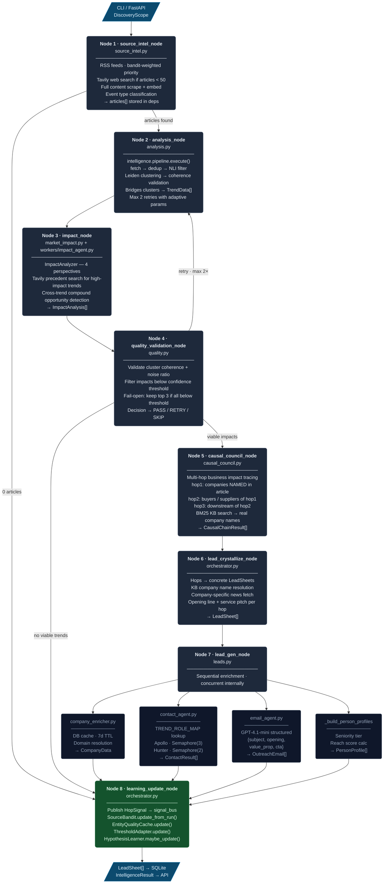

# app/agents/ — LangGraph Multi-Agent Pipeline

8-node `StateGraph` (pydantic-ai, `stream_mode="updates"`). Nodes 1–3 run intelligence gathering and impact analysis; Nodes 4–6 validate quality, trace causal chains, and crystallize leads; Nodes 7–8 enrich leads and close the self-learning loop.

```
agents/
├── orchestrator.py       # StateGraph definition, compile(), all node functions
├── deps.py               # AgentDeps (lazy-init shared state), HopSignal, LearningSignal
├── source_intel.py       # Node 1: RSS + web fetch, scrape, embed, classify
├── analysis.py           # Node 2: intelligence/pipeline.execute() → TrendData[]
├── market_impact.py      # Node 3: 4-perspective impact analysis
├── quality.py            # Node 4: quality gate — validate, filter, retry
├── causal_council.py     # Node 5: multi-hop causal chain tracer
└── workers/
    ├── schemas.py         # Output Pydantic models for all workers
    ├── company_agent.py   # (imported by lead_gen) — company enrichment
    ├── contact_agent.py   # ContactFinder: Apollo + Hunter (TREND_ROLE_MAP)
    ├── email_agent.py     # EmailGenerator: GPT-4.1-mini structured emails
    ├── impact_agent.py    # ImpactAnalyzer called from market_impact.py
    ├── impact_council.py  # Single structured LLM call — 4-field ImpactCouncilResult
    └── lead_validator.py  # LLM quality gate for company-trend pairing
```

---

## Pipeline Flow



---

## GraphState (TypedDict)

```python
class GraphState(TypedDict):
    """LangGraph state shared across all agent nodes."""
    deps: Any                                       # AgentDeps instance
    run_id: str                                     # Unique run identifier (datetime)
    trends: List[TrendData]
    impacts: List[ImpactAnalysis]
    companies: List[CompanyData]
    contacts: List[ContactData]
    outreach_emails: List[OutreachEmail]
    errors: Annotated[List[str], operator.add]
    current_step: str
    retry_counts: Dict[str, int]
    agent_reasoning: Dict[str, str]
```

`Annotated[list, operator.add]` — LangGraph merges list fields by concatenation across parallel branches.

**Critical**: `stream_mode="updates"` — NEVER `"values"`. `AgentDeps` contains asyncio locks; `"values"` attempts to serialize the full state dict, crashes on non-serializable objects.

---

## AgentDeps (deps.py)

Lazy-initialized shared state container. All properties initialize on first access, never on import.

```python
class AgentDeps:
    @property
    def llm_service(self) -> LLMService:         # full model (GPT-4.1-mini chain)
    @property
    def llm_lite_service(self) -> LLMService:    # lite model (GPT-4.1-nano chain)
    @property
    def tavily_tool(self) -> TavilyTool:         # primary web search
    @property
    def rss_tool(self) -> RSSTool:               # 92 region-filtered RSS feeds
    @property
    def apollo_tool(self) -> ApolloTool:         # contact search (Semaphore in tool: 3)
    @property
    def hunter_tool(self) -> HunterTool:         # email finding (Semaphore in tool: 2)
    @property
    def embedding_tool(self) -> EmbeddingTool:   # NVIDIA/OpenAI embeddings
    @property
    def article_cache(self) -> ArticleCache:     # ChromaDB article store
    @property
    def source_bandit(self) -> SourceBandit:     # Thompson Sampling source ranking
    @property
    def company_bandit(self) -> CompanyRelevanceBandit:
    @property
    def meta_reasoner(self) -> MetaReasoner:     # chain-of-thought retrospective
    @property
    def search_manager(self) -> SearchManager:   # BM25 + DDG fallback search
    @property
    def recorder(self):                          # RunRecorder (None in mock mode)
```

**Never import heavy deps at module level** — tool classes connect to APIs on init.
Semaphores are defined in the tool files (`apollo_tool.py: Semaphore(3)`, `hunter_tool.py: Semaphore(2)`), not in AgentDeps.

---

## Node 1: Source Intel

`source_intel.py` — pydantic-ai agent with 5 tools:

| Tool | Purpose |
|------|---------|
| `check_source_quality` | Query SourceBandit for quality estimates — fetch order by score |
| `fetch_rss` | Google News RSS + configured feeds, bandit-weighted |
| `search_web` | Tavily targeted search, triggered when articles < 50 |
| `scrape_and_embed` | Full-content scrape + NVIDIA/OpenAI embeddings |
| `classify_events` | Tag articles: `regulation`, `funding`, `technology`, `trade_policy`, … |

Conditional edge: 0 articles → skip directly to `learning_update_node`.

---

## Node 2: Analysis

`analysis.py` calls `intelligence.pipeline.execute()` via pydantic-ai tool. The intelligence pipeline runs 9 math gates before any LLM call:

```
Fetch → Dedup → NLI Filter → Entity Extraction → Similarity
→ HAC+HDBSCAN+Leiden Clustering → Validate → Synthesize → Match
```

Results bridged via `_intelligence_clusters_to_trends()`:

```
coherence >= 0.70  →  severity = HIGH
coherence 0.50–0.70 → severity = MEDIUM
coherence < 0.50   →  severity = LOW
```

Agent retries up to 2× with adjusted `dedup_title_threshold` / `coherence_min` if `mean_coherence < 0.40` or `noise_ratio > 0.40`.

---

## Node 3: Impact Council

`workers/impact_council.py` — 4-perspective structured LLM call, moderated synthesis:

```python
class ImpactCouncilResult(BaseModel):
    perspectives: List[CouncilPerspective]          # One per analyst perspective
    consensus_reasoning: str                         # Multi-paragraph moderator synthesis
    debate_summary: str                              # Key disagreements + resolution
    detailed_reasoning: str
    pitch_angle: str
    service_recommendations: List[ServiceRecommendation]
    evidence_citations: List[str]
    overall_confidence: float                        # 0.0-1.0
    affected_sectors: List[str]
    affected_company_types: List[str]
    pain_points: List[str]
    business_opportunities: List[str]
    target_roles: List[str]
```

**Why causal chain is required**: prevents hallucination of second-order effects. Each `CouncilPerspective` must include a causal chain; if it can't be articulated, confidence → 0.0 and the perspective is dropped.

---

## Node 4: Quality Validation

`quality.py` — pydantic-ai agent that validates both trends and impacts:

```
Post-Analysis checks:
  mean coherence >= 0.45, noise ratio < 0.35, >= 3 clusters
  → RETRY if borderline (max 2 retries total)

Post-Impact filtering:
  Drop impacts below council_confidence threshold
  Fail-open: if ALL fail → keep top 3 by confidence score
  (prevents zero-output runs from poor clustering)
```

Conditional edge returns: `"analysis"` (retry), `"end"` (no viable → learning), `"lead_gen"` (maps to causal_council).

---

## Node 5: Causal Council

`causal_council.py` — multi-hop business impact tracer using pydantic-ai tool calling + BM25 KB search:

```
hop1: Companies directly NAMED in the article (evidence required)
hop2: Buyers, suppliers, or partners of hop1 companies
hop3: Downstream chain from hop2

For each hop:
  segment       = affected industry segment (e.g. "Steel importers")
  mechanism     = specific pain/opportunity explanation
  companies_found = real company names from BM25 KB search
  confidence    = 0.0–1.0 (hops below 0.35 dropped in crystallize)
  lead_type     = "pain" | "opportunity" | "risk" | "intelligence"
```

`LearningSignal` emitted per trend with `kb_hit_rate` — fraction of hops where KB returned real company names.

---

## Node 6: Lead Crystallize

`lead_crystallize_node` in `orchestrator.py` converts `CausalChainResult[]` → `LeadSheet[]`:

```
For each hop above confidence 0.35:
  1. Resolve segment → real company names (KB lookup)
  2. Fetch company-specific recent news (ChromaDB)
  3. Assign contact_role via _CONTACT_ROLES[event_type]
  4. Assign service_pitch via _SERVICES[(lead_type, event_type)]
  5. Generate opening_line (ready-to-use first sentence for call/email)

Output: LeadSheet sorted by (confidence DESC, urgency_weeks ASC)
```

---

## Node 7: Lead Gen Workers

`run_lead_gen()` in `leads.py` runs 4 enrichment phases sequentially (each concurrent internally):

### Phase 1: Company Enrichment

```
1. DB cache lookup (7-day TTL) via get_or_enrich_company()
2. Domain resolution: web search → extract_clean_domain()
3. Batch enrich via company_enricher.enrich() — Semaphore(5), 8s timeout
   → CompanyData {name, domain, industry, description, headquarters, ceo, founded_year}
```

### Phase 2: Contact Finding (contact_agent.py)

```
1. TREND_ROLE_MAP → target roles for this event type
2. Apollo: search_people_at_company(domain, roles, limit) — Semaphore(3)
3. Hunter: find_email(domain, full_name) — Semaphore(2)
4. Filter: EMAIL_CONFIDENCE_THRESHOLD = 70
   → ContactResult[] sorted by confidence DESC
```

### TREND_ROLE_MAPPING

Defined in `app/config.py:TREND_ROLE_MAPPING`. Each category maps to 4 ordered roles (most senior first). `contact_agent.py:match_roles_to_trend()` scans article text for keywords to select the category.

| Category key | Roles |
|--------------|-------|
| `regulation` / `policy` | CEO, Chief Strategy Officer, VP Strategy, Director Biz Dev |
| `trade` | VP Supply Chain, Procurement Director, CPO, Director Sourcing |
| `market_shift` / `competition` | CMO, VP Marketing, Chief Strategy Officer |
| `technology` / `digital_transformation` | CTO, VP Engineering, Chief Digital Officer |
| `expansion` / `market_expansion` | CEO, VP Business Development, CSO |
| `supply_chain` | COO, VP Operations, CPO, Director Supply Chain |
| `funding` | CEO, CFO, Chief Strategy Officer, VP Corporate Development |
| `cybersecurity` | CISO, VP Security, Head of Information Security |
| `compliance` / `data_privacy` | CCO, VP Legal, DPO, General Counsel |
| `ai_adoption` | CTO, Chief AI Officer, VP Engineering, Head of Data Science |
| `cloud_migration` | CTO, VP Infrastructure, Head of Cloud, IT Director |
| `cost_reduction` | CFO, COO, VP Operations, Head of Procurement |
| `sustainability` | Chief Sustainability Officer, VP Sustainability, Head of ESG |
| `talent` | CHRO, VP People, Head of Talent, HR Director |
| `default` | CEO, CTO, CFO, VP Operations, Head of Strategy |

### Phase 3: Email Generation (email_agent.py)

Structured output schema enforced via GPT-4.1-mini `response_format=json_schema`:

```json
{
  "subject": "string (max 60 chars)",
  "opening_sentence": "string — references the specific news event",
  "value_proposition": "string — connects event to product benefit",
  "social_proof": "string — specific case study or metric",
  "call_to_action": "string — single, specific ask",
  "ps_line": "string (optional) — additional hook"
}
```

`company.news_snippets[0]` injected into prompt so email references the actual triggering event (date, deal size, location).

### Phase 4: Person Profiles

```
_build_person_profiles() → PersonProfile[]
  seniority_tier: "decision_maker" | "influencer" | "gatekeeper"
  reach_score: composite of email confidence + verified + linkedin + tier + role_relevance
  Sorted: decision_maker first, then by reach_score DESC
```

---

## Worker Concurrency Limits

Semaphores are **module-level constants in each tool file**, not in AgentDeps:

```python
# app/tools/crm/apollo_tool.py
_APOLLO_SEM = asyncio.Semaphore(3)   # Apollo: 3 concurrent

# app/tools/crm/hunter_tool.py
_HUNTER_SEM = asyncio.Semaphore(2)   # Hunter: 2 concurrent

# LLM concurrency managed by pydantic-ai FallbackModel (10 concurrent)
```

Workers are standard async functions — not LangGraph nodes. Pattern:

```python
async def run_worker(deps: AgentDeps, trend: TrendData, ...) -> Schema:
    async with deps.apollo_sem:
        result = await deps.apollo.search_people_at_company(...)
    return Schema(**result)
```

---

## Key Rules

- `stream_mode="updates"` — NEVER `"values"` (AgentDeps serialization crash)
- `AgentDeps` uses lazy `@property` — NEVER import heavy deps at module level
- All CRM imports: `from app.tools.crm.*` — never at flat path
- Provider calls: always through `deps.llm` (uses ProviderManager fallback chain)
- Learning signals → `signal_bus.py` only — never direct cross-loop imports
- `from __future__ import annotations` is BANNED with local classes + `get_type_hints()`
