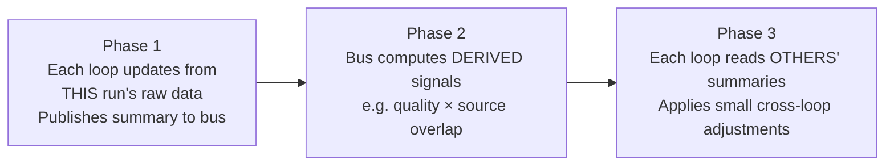
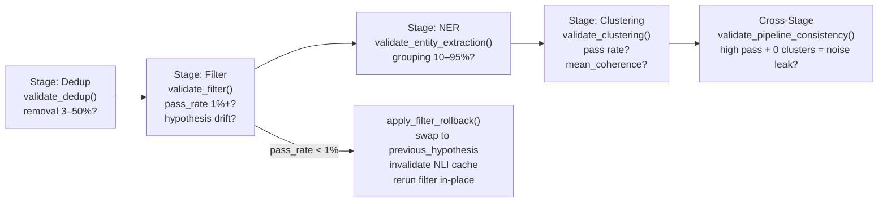

# app/learning/ — Self-Learning System

7 learning loops that improve the pipeline between runs. All loops communicate via `signal_bus.py` exclusively — **no direct imports between loops**.

```
learning/
├── signal_bus.py          # Cross-loop pub/sub backbone (persisted: data/signal_bus.json)
├── source_bandit.py       # Loop 1: Thompson Sampling over 107 RSS source arms
├── hypothesis_learner.py  # Loop 2: SetFit → updates NLI filter hypothesis
├── weight_learner.py      # Loop 3: EWC dual-weight system for quality signal blending
├── company_bandit.py      # Loop 4: Thompson Sampling over (company_size × event_type) arms
├── contact_bandit.py      # Loop 5: Thompson Sampling over contact role × event_type arms
├── threshold_adapter.py   # Loop 6: EMA-based coherence/merge/signal threshold adaptation
├── dataset_enhancer.py    # Auto-labels articles → SetFit bootstrap
├── path_router.py         # Q-Learning router: selects which discovery path to activate
├── experiment_tracker.py  # Logs experiment variants to data/experiments.jsonl
├── pipeline_metrics.py    # Metrics collector → data/pipeline_run_log.jsonl
├── pipeline_validator.py  # Stage-by-stage pass/fail validation with consistency checks
└── meta_reasoner.py       # Chain-of-thought retrospective + improvement hypotheses
```

---

## Signal Bus — Cross-Loop Protocol

`signal_bus.py` implements a **three-phase no-circular-reads protocol**:



Published fields per run:
- `nli_filter`: `{mean, rejection_rate, hypothesis_version, scores_by_source: Dict[str, float]}`
- `clustering`: `{n_clusters, mean_coherence, entity_coverage, noise_rate}`
- `source_bandit`: `{posteriors: Dict[str, {alpha, beta}]}`
- `feedback`: `{total, positive, negative, recent_labels: List[str]}`

Persisted to `data/signal_bus.json` (warm start). No inter-loop direct imports.

**Research**: Collaborative Multi-Armed Bandits (Landgren et al., 2016); HEBO shared observation table (Cowen-Rivers et al., NeurIPS 2020).

---

## Loop 1 — Source Bandit (`source_bandit.py`)

**What it learns**: Which RSS sources produce B2B-signal articles worth clustering.

**Algorithm**: Thompson Sampling over Beta(α, β) posteriors.

**Thompson Sampling update rule**:
```
For each article from source s:
  if article passes NLI filter AND contributes to a passing cluster:
    reward_s = 0.30 × nli_score          # NLI filter pass rate for this source
           + 0.25 × cluster_quality     # mean coherence of clusters it contributed to
           + 0.15 × uniqueness          # inverse dedup rate (high dedup = low uniqueness)
           + 0.10 × entity_richness     # fraction of articles with ≥1 B2B entity
           + 0.10 × content_quality     # full-text availability rate
           + 0.10 × oss_score           # synthesis specificity of articles
    α_s += reward_s              # success count
    β_s += (1 - reward_s)        # failure count
  else:
    β_s += 1.0                   # pure failure

At fetch time:
  for each source s:
    θ_s ~ Beta(α_s, β_s)        # sample from posterior
  Fetch sources in descending θ_s order
```

**Posterior mean** = α / (α + β) ≈ source quality estimate.

**Informed priors** (Russo et al. 2018, arXiv:1707.02038):
- B2B-tagged sources (ET, LiveMint, Inc42): Beta(3, 1) → prior mean 0.75
- Noise-tagged sources (sports, entertainment): Beta(1, 3) → prior mean 0.25
- Unknown sources: Beta(1, 1) → flat prior mean 0.50

Why informed priors: Thompson Sampling converges in O(K log n) with uninformed priors vs O(K) with informed. At 107 sources, informed priors save ~4 runs of wasted fetches.

**Real data** (after 5 runs):
- ET Industry: α=1.12, β=2.28 → mean 0.329 (deprioritized, mostly opinion)
- Google News Startup: α=3.44, β=2.11 → mean 0.620 (consistently B2B signals)

**Persisted**: `data/source_bandit.json`

**Research**: Chapelle & Li (2011) "An Empirical Evaluation of Thompson Sampling"; Russo et al. (2018) arXiv:1707.02038.

---

## Loop 2 — Hypothesis Learner (`hypothesis_learner.py`)

**What it learns**: The NLI filter hypothesis text (what counts as B2B-relevant news).

**Algorithm**: SetFit (arXiv:2209.11055) — few-shot contrastive sentence-transformer fine-tuning.

**How SetFit works**:
```
1. Take N labeled examples (8 pos + 8 neg minimum)
2. Generate K contrastive pairs: (pos_i, pos_j) → 1, (pos_i, neg_j) → 0
   K = N × (N-1) / 2 × 2 ≈ 112 pairs from 8+8 examples
3. Fine-tune: sentence-transformer classification head on pairs
   Loss = CosineSimilarity(embed_i, embed_j) vs label (cosine contrastive)
4. Classify ALL recent articles with updated embeddings
5. Use updated scores to generate candidate hypothesis via LLM
6. Validate candidate hypothesis on held-out Reuters/AG News examples
7. Deploy if F1 improves ≥ 5% on validation set
```

**Why 8 examples ≈ 3000-example fine-tune**: SetFit leverages pre-trained sentence embeddings (already know what "raising capital" means). Fine-tuning only adjusts the classification head, not the full model. Result: 87.9% accuracy on sentence classification with 8 examples (Tunstall et al. 2022 Table 2).

**Minimum threshold**: `N_MIN_EACH = 8` (positive + negative per class before training).

**Training data sources** (priority order):
1. Cluster articles with coherence > 0.70 → POSITIVE (math-confirmed B2B)
2. NLI-rejected articles with score < 0.10 → NEGATIVE (high-confidence noise)
3. Reuters-21578 earn/acq categories → POSITIVE (ground truth)
4. AG News Business → POSITIVE; Sports/World → NEGATIVE

**2-gate validation before deployment**:
```
Gate 1 (absolute): new_hypothesis B2B_mean ≥ 0.55     (absolute floor — prevents drift)
Gate 2 (relative): regression vs current hypothesis ≤ 10% on production examples

If either gate fails → reject candidate, keep current hypothesis
```

**Hypothesis grammar rules** (arXiv:1909.00161 §3 — violation causes model-wide low scores):
1. Structure: `"This article reports on a specific company named in the text that is [ACTION]..."` — NEVER change prefix
2. NEVER add negation (NOT/except/unless) — NLI outputs near-zero entailment for negated hypotheses on ALL inputs
3. NEVER use meta-descriptions ("business news report") — NLI trained on factual statements, not meta-labels
4. Only extend the action verb list at end

**Current hypothesis** (`data/filter_hypothesis.json`):
```
"This article reports on a specific company named in the text that is growing,
raising capital, launching a product, releasing a model or technology, making
an acquisition, facing a regulatory action, issuing a product recall, signing
a major contract, filing for an IPO, entering a partnership, or making a
strategic business move."
```

**Persisted**: `data/filter_hypothesis.json` (includes `previous_hypothesis` for in-run rollback).

**Research**: Tunstall et al. (2022) arXiv:2209.11055; arXiv:2401.09555; arXiv:2502.12965.

---

## Loop 3 — Weight Learner (`weight_learner.py`)

**What it learns**: Quality signal blend weights for trend scoring (6 similarity signals).

**Algorithm**: EWC (Elastic Weight Consolidation) dual-weight system.

**Dual-weight update rule**:
```
Active weights W_a:  updated every run (fast adaptation, lr = base_lr / √n_feedback)
Stable weights W_s:  updated every 10 runs (slow, conservative, lr = 0.1 × base_lr)

KL divergence check:
  if KL(W_a || W_s) > 0.15:
    W_a = 0.70 × W_a + 0.30 × W_s    (blend back toward stable)

Weight update from feedback signal f:
  Δw_k = lr × f × (signal_k - mean_signals)      (gradient-free update)
  w_k = clip(w_k + Δw_k, 0.02, 0.40)            (clamp to [0.02, 0.40])
  W = W / sum(W)                                  (normalize to sum 1.0)
```

**EWC forgetting prevention** (Kirkpatrick et al. 2017):
```
L_EWC = L_task + λ × Σ_k  F_k × (w_k - w*_k)²

Where:
  w*_k    = stable weights (consolidated)
  F_k     = Fisher information (estimate of weight importance)
  λ       = 0.4 (regularization strength)
```

Fisher information is approximated as `mean(∂L/∂w_k)²` over recent feedback batches. Weights with high Fisher (consistent predictors of quality) are penalized more for deviating from stable values.

**Priority**:
1. Human feedback (50+ records) — 3× learning rate
2. Outcome-based auto-learning (5+ runs) — uses cluster quality as proxy
3. Default weights — cold start

Default weights: semantic=0.35, entity=0.25, source=0.15, event=0.10, temporal=0.10, lexical=0.05.

**Persisted**: `data/weight_learner.json`

**Research**: Kirkpatrick et al. (2017) "Overcoming Catastrophic Forgetting in Neural Networks" (EWC).

---

## Loop 4 — Company Bandit (`company_bandit.py`)

**What it learns**: Which (company_size × event_type) combinations convert to leads.

**Algorithm**: Contextual Thompson Sampling.

```
Arms: {company_size: smb|mid|enterprise} × {event_type: funding|expansion|product_launch|...}
    = 3 × 7 = 21 contextual arms

For each arm a:
  θ_a ~ Beta(α_a, β_a)     # sample from posterior

Reward after lead scoring:
  if lead_score > threshold:
    α_a += lead_score        # weighted success
    β_a += (1 - lead_score)
  else:
    β_a += 1.0
```

**Persisted**: `data/company_bandit.json`

---

## Loop 5 — Contact Bandit (`contact_bandit.py`)

**What it learns**: Which contact roles generate email engagement per event type.

**Algorithm**: Thompson Sampling.

```
Arms: {contact_role} × {event_type}
  e.g. (CTO, AI_adoption) vs (CFO, funding) vs (CEO, expansion)

Rewards:
  email_opened  → α += 0.5
  email_replied → α += 1.0
  email_bounced → β += 0.5
  no_response   → β += 0.1 (weak implicit negative)

Reward signal source:
  → Brevo webhook (open/click events)
  → IMAP reply polling (imaplib) for replies
```

**Why Thompson vs UCB**: Thompson naturally handles cold-start arms (uncertain arms get explored proportionally to their uncertainty). UCB would over-explore all 21×N arms equally. With sparse email feedback, Thompson converges faster.

**Persisted**: `data/contact_bandit.json`

---

## Loop 6 — Threshold Adapter (`threshold_adapter.py`)

**What it learns**: Optimal coherence, merge, and signal thresholds per article volume.

**Algorithm**: Exponential Moving Average (EMA) per threshold.

```
EMA_t = α × observed_t + (1 − α) × EMA_{t-1}    α = 0.1

Thresholds updated after each run:
  coherence_threshold_t = EMA_coherence × 0.80    (80% of recent mean)
  merge_threshold_t     = EMA_merge
  min_community_size_t  = round(EMA_min_community)

Stability gate — no update if:
  |observed_t − EMA_{t-1}| < 0.02     (prevents micro-oscillations)
```

EMA with α=0.1 gives ~9-run effective window (1/α − 1 = 9 runs at ≥50% weight).
Conservative α=0.1 prevents a single anomalous run from drastically shifting thresholds.

**Persisted**: `data/adaptive_thresholds.json`

---

## Dataset Enhancer (`dataset_enhancer.py`)

Auto-builds the SetFit training set from run results — no human annotation.

| Source | Label | Condition |
|--------|-------|-----------|
| Cluster articles (coherence > 0.70 AND NLI > 0.85) | POSITIVE | Both math gates — prevents noisy clusters becoming training data |
| NLI-rejected articles (score < 0.10) | NEGATIVE | High-confidence noise (confidence = 1 − NLI_score) |
| Cluster articles (coherence < 0.25) | NEGATIVE | Passed NLI but useless — fooled the filter |
| Reuters-21578 earn/acq/corp categories | POSITIVE | Gold-standard business news labels |
| Reuters-21578 grain/macro/dlr categories | NEGATIVE | Gold-standard macro/commodity noise |
| AG News Business class | POSITIVE | Global business signal |
| AG News Sports/World classes | NEGATIVE | Global non-business noise |

**Why dual gate for cluster positives** (coherence > 0.70 AND NLI > 0.85):
- Coherence-only: topically coherent noise clusters (e.g. Jim Cramer commentary) would become positive training examples — wrong
- NLI-only: an article that scored 0.60 (ambiguous zone) but appeared in a low-quality cluster should not reinforce the hypothesis
- Both gates together confirm the article is genuinely a B2B signal

Auto-deduplication: MD5 hash of text content.
Class balancing: max 2:1 positive:negative ratio.
Retraining trigger: ≥ 25 positive + ≥ 25 negative examples accumulated.

---

## Path Router (`path_router.py`)

**What it learns**: Which discovery path (Industry-First / Company-First / Report-Driven) to activate per context.

**Algorithm**: Q-Learning with ε-greedy exploration.

```
State:  s = (industry_id, news_volume_band, account_list_active, urgency_flag)
Action: a = path priority weights (3 floats summing to 1.0)

Q-table update (Bellman):
  Q(s, a) ← Q(s, a) + α × [R(s,a) + γ × max_a' Q(s', a') − Q(s, a)]

Where:
  α = 0.1         (learning rate)
  γ = 0.9         (discount factor — future engagement matters)
  R(s,a) = email_engagement_rate × lead_quality_score

Exploration: ε-greedy with ε = 0.30 (explore 30% of runs initially)
  ε decays linearly to 0.05 after 50 runs with feedback
```

Q-table stored in `data/path_router.json`. After 5+ consistent-feedback runs → measurable path preference shift visible in table.

---

## Pipeline Validator (`pipeline_validator.py`)

Per-stage self-correction without human intervention.



| Validator | Key checks | Auto-action |
|-----------|-----------|-------------|
| `validate_dedup(raw, deduped, pairs)` | removal rate 3-50% | WARN if out of range |
| `validate_filter(in, kept, auto_accepted, auto_rejected, llm, nli_mean, fp)` | pass_rate ≥ 1%, hypothesis drift | `apply_filter_rollback()` if pass_rate < 1% |
| `validate_entity_extraction(in, groups, grouped, ungrouped)` | grouping rate 10-95% | WARN if out of range |
| `validate_clustering(in, total, passed, failed, noise, mean_coh)` | pass rate, coherence floor | WARN if regression |
| `validate_pipeline_consistency(stage_results)` | cross-stage sanity | WARN on impossible combinations |

`apply_filter_rollback()`:
1. Load `previous_hypothesis` from `data/filter_hypothesis.json`
2. Swap hypothesis string in NLI filter
3. Invalidate NLI score cache (forces re-score)
4. Rerun filter in same pipeline execution (no restart needed)

---

## Experiment Tracker (`experiment_tracker.py`)

Snapshots experiment state for regression detection.

**Snapshot includes**:
- `data/filter_hypothesis.json` (hypothesis text + version)
- `data/nli_baseline.json` (baseline F1 scores)
- Pipeline metrics (n_clusters, mean_coherence, pass_rate)

**Regression rollback**:
```
If F1(new_hypothesis) < F1(baseline) − 0.05:     (5% regression threshold)
    restore hypothesis from snapshot
    log experiment as FAILED in data/experiments.jsonl
```

Regression check uses Reuters-21578 test split as ground truth (fixed external dataset, not affected by hypothesis changes).

---

## Key Invariants

- Loops communicate via `signal_bus.py` ONLY — no direct cross-loop imports
- All persistent state in `data/*.json` or `data/*.jsonl` — never in memory (restart-safe)
- Every loop loads state on init, saves immediately after each update
- Learning updates run in Phase 10 (final pipeline stage) via `asyncio.gather()` — parallel, non-blocking
- `company_bandit.py` was `agents/company_relevance_bandit.py` pre-March 2026 — import from `app.learning.company_bandit`
